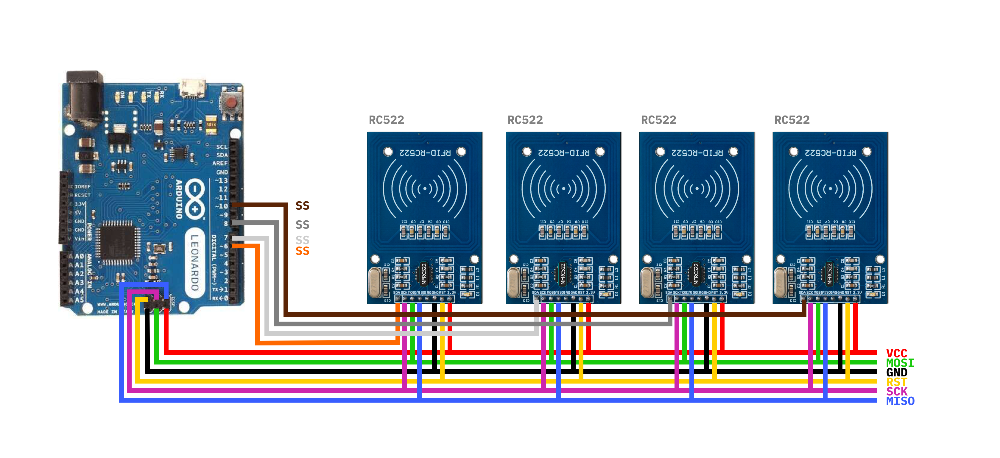

# Formloupe Readme

## Unity setup

- Unity 2019.1.0f2
- Vuforia 8.1.7
- Ardity

## Hardware setup

- Surface Pro 6
- Arduino Leonardo
- RC522 RFID Readers

Will send read / removed tags over serial to the COM port 3 on the Surface.
Messages there are read by Unity app.

### Arduino Pinout

Plug Arduino into surface with USB cable.
Multiple RFID readers talk to Arduino over SPI.

## RFID Tag - Material Mapping

- 188718099 - Pinewood Untreated
- 23321231217 - Pinewood Cinnamon
- 10114931217 - Pinewood Coffee
- 4314431217 - Aluminium Grey
- 176532217 - Aluminium White
- 498731217 - Steel Grey
- 1715938131 - Leather Ash
- 15413242131 - Leather Coffee
- 6510335217 - Leather Latte
- 2027235217 - Suede Latte
- 8212131217 - Cotton Beige
- 21816530217 - Cotton Blue
- 13711735217 - Acrylic White
- 223031217 - Acrylic Black
- 15112031217 - Acrylic Transparent